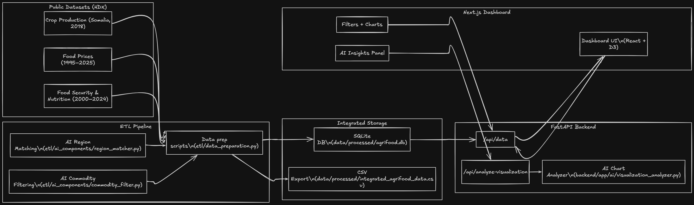

# Project Journey

This file documents how I approached the challenge and the key decisions I made along the way.

## 1) Discovery and use‑case definition

I started by browsing the HDX website to understand what types of agrifood datasets were available. Then I brainstormed with ChatGPT to shape a concrete use case in the agrifood development domain, and mapped that idea to the data I could realistically source.

The hardest part was finding 2–3 datasets from different sources that tell a coherent story and share a compatible timeline. I spent a full day on this step because it is the core of the project. I ultimately narrowed the scope to Somalia since the available datasets had consistent regional breakdowns and overlapping time ranges.

## 2) Dataset selection and rationale

I selected three datasets that, together, provide a useful NGO‑style story about food security:

1) **Crop production (Somalia, 2018 baseline)**  
   - Dataset: Climate crop production (Somalia admin1)  
   - Link: https://data.humdata.org/dataset/climada-crop-production-dataset  
   - File: `somalia-admin1-crop-production.csv`  
   - Notes: 974 lines; only 2018 values, which is a limitation but still a valuable baseline for local supply capacity.

2) **Food prices (Somalia, 1995–2025)**  
   - Dataset: WFP food prices for Somalia  
   - Link: https://data.humdata.org/dataset/wfp-food-prices-for-somalia  
   - Notes: 37,539 lines; long timeline with rich market price data.

3) **Food security and nutrition indicators (2000–2024)**  
   - Dataset: Suite of food security indicators (Somalia)  
   - Link: https://data.humdata.org/dataset/suite-of-food-security-indicators  
   - Notes: 974 lines; national‑level indicators across two decades.

These three datasets form a strong combination: prices reflect market access, crop production reflects local supply, and nutrition indicators reflect human outcomes. From an NGO perspective, combining them helps explain where price shocks coincide with weaker production capacity and worsening nutrition trends.

## 3) Data understanding (CRISP‑DM)

I followed a CRISP‑DM‑inspired process, which I often use in data projects:

- **Understanding notebook**: I created `etl/1-understanding.ipynb` to explore the raw CSVs and document key observations (e.g., missing year column in crop production, and domain‑specific indicator codes).
- **Preparation notebook**: I then created `etl/2-preparation.ipynb` to implement the integration steps and document the data transformations.

This notebook‑first approach helped me validate assumptions before writing production code.

## 4) ETL pipeline and AI integration

After finalizing the logic in the notebook, I created a clean Python script (`etl/data_preparation.py`) that reproduces the pipeline and writes:

- `data/processed/integrated_agrifood_data.csv`
- `data/processed/agrifood.db` (SQLite)

### AI component: Region name matching

One integration issue was mismatched region names across datasets (about 22 admin1 regions). To avoid hardcoding a brittle mapping, I used a lightweight AI step:

- File: `etl/ai_components/region_matcher.py`
- Approach: Use the OpenAI‑compatible client with **Gemini 2.5 Flash** to map region names between datasets and return a JSON mapping.  
  Docs: https://ai.google.dev/gemini-api/docs/openai

This made the merge more robust and saved time compared to manual mapping.

## 5) Backend API

I chose **FastAPI** for speed and familiarity. The backend reads the SQLite database and exposes the data as JSON for the dashboard.

I started with a single `/data` endpoint and later refactored to a modular router structure as I added more functionality.

## 6) Frontend dashboard

I used **Next.js** (installed via `pnpm create next-app@latest`) to build the dashboard.  
Docs: https://nextjs.org/docs/app/getting-started/installation

I brainstormed the dashboard layout with ChatGPT and used Cursor to accelerate UI scaffolding. The final charts were supervised and iterated by me.

I used **D3** for the visualizations (my first time using it):  
Docs: https://d3js.org/getting-started

### Map visualization

To visualize regional price averages, I integrated a Somalia admin1 GIS map from:
https://simplemaps.com/gis/country/so#admin1

This enabled a choropleth‑style visualization aligned with the admin1 regions.

## 7) Dockerization

I created separate Dockerfiles for:

- **ETL** (runs the data pipeline)
- **Backend** (serves FastAPI)
- **Frontend** (builds and serves Next.js)

Then I connected them in `docker-compose.yml` so the ETL runs first, the backend starts after the data is generated, and the frontend depends on the backend. This makes the project easy to run end‑to‑end with a single command.

## 8) AI‑powered visualization analysis

After the dashboard was working, I looked for a creative AI feature. I implemented a **chart analysis assistant**:

- Frontend captures a chart area as an image using `html-to-image`.
- Backend endpoint `/analyze-visualization` sends the image + metadata (title, chart type) to Gemini.
- The AI returns a concise explanation of the chart, streamed back to the UI.

Key files:

- `backend/app/ai/visualization_analyzer.py` — image‑aware prompt and model call
- `backend/app/api/endpoints/analysis.py` — API endpoint
- `frontend/components/ui/Card.tsx` — UI trigger, streaming, and Markdown rendering

This feature helps users interpret the visuals quickly and demonstrates practical use of multimodal AI in the workflow.

## Architecture diagram



Created with Excalidraw: https://excalidraw.com/

## Closing note

The most time‑consuming part was curating a meaningful dataset trio. Once that foundation was set, I focused on building a clean, reproducible pipeline, a minimal API, and a dashboard with a small but useful AI enhancement.

<details>
<summary>Prompt I used to generate this file</summary>

```
lets create a journey md file to talk about how i approched the project, 
first i started browsing the hdx website to explore it and then i satrted brainstorming with chatgpt a good use case idea regarding the agrifood development domain to then go and search what data i have available, this was the hardest part for me, to find a 2-3 datasets from different sources that tell a good story and have matching timeline, i spent a lot on this task as i knew this was the core thing of the project, so after one day of woring on this i found 3 different datasets about agrifood in somalia as it was really hard and time consuming to find data about multiple countires in different sources, i opted for somalia as the dataset i choose has a lot of reagions that preatty much match with each other, so the first dataset is a pretty know one in hdx which the crop production one that has 21 csv files each one for a country and one of them is somalia with 974 lines 1,257 (there is a huge downside to this as its only in the year 2018) https://data.humdata.org/dataset/climada-crop-production-dataset ( somalia-admin1-crop-production.csv )  , the second datasend i found was i also a preatty well know and downloaded one is the food prices in somalia, this dataset is very rich and has a lot of usuful information with 37,539 lines as it dates from 15 January 1995 - 15 December 2025 https://data.humdata.org/dataset/wfp-food-prices-for-somalia, and the last dataset is the Food Security and Nutrition Indicators one, this is also a very rich dataset datting from 01 January 2000 - 31 December 2024 with 974 lines. these 3 dataset where a good combo as they answer a lot of questions abou agrifood in somalia and also from the POV of an NGO it has a lot of pottentiel ( explain why)
so after downloading the datasets and saw how much time it took me to find one i opted to start with coding and technical stuff, the first thing i started doing is creating a new repo in github and cloning it locally and then i started seting up my env with uv (its my favoirite python package manager, i recommand it to everyone) initilizing my venv and and python version and initial deps , so after imporating the csv file i started with a preatty common approch in data analysis called CRISP DM, i worked a lot with this method in verious projects and its very esential when starting a project with data, so i started with creating a understanding python notebook file to load my csv files and and explore them, and as im exploreing and undrstand what am i dealing with i started taking notes about my data for exmaple that the crop production dataset doesnt have a year column and had some industry abbriviations that i had to search and understand, so after finishing the understanding part and took a lot of note i continued with the same approch and created a preapation python notebook file to start taking action with my dataset, i set a final structure in mind that i wanted to reach and started working with the notes i took as you can see in the @etl/2-preparation.ipynb  file (i wont go to details an its well commented and very straight forward),  so when i was working i kept in mind the ai component i had to do with my data intergration pipeline to help me spped up the process and not have to hard code a lot of things, and indeed i encountered a problem where in the two different datasets i had different region names but same meaning and they were preatty hhefty ( 22 regions ) so its only logic to implement a ai component to help me match regions to each other, and this is where i used GEN AI to do this as they are well trained to do these kind of tasks, i levraged the openai library as every ai provider has openai compatibility (so if i wanted to change another model in the future i can easily without chaging the output structure or barly any code ) , i used the Google gemini-2.5-flash model (https://ai.google.dev/gemini-api/docs/openai ) to help me match two regions list names to each other @etl/ai_components/region_matcher.py (explain this file brifly) to return a json object i can continue to use in my preapation, so when i finished my fianl touches in the preapation notebook i used my ai coding ide to create me a single script that does the same thing but in a .py file, and here where i added a light databse , i used sqlite for the ease of use and setup to save my final table in and also in a csv file. so at this point i was happy about the prgress of my etl pipeline i started with the backend, i opted for python fastapi famework as im very familiar with it and easy to use, i created a single file with an endopint /data at first that connect to the db file created with sqllite and consumes and query it to return the whole data in json format, this wa svery quick and easy so i immeditly started with the frontend, i opted to use next js as im familiar with it, downloaded the latest version using pnpm create next-app@latest frontend --yes (https://nextjs.org/docs/app/getting-started/installation ) and i immeditly started brainstorming ith chatgpt what i want to put in my dashboard and how i wanted it to look like and helped me create a plan to then use my ai coding ide cursor to help me speed up the process ( the frontend code was heavly generated by ai but supuervised and guided completly by me ) i used the d3 library as suggested in the document challenge and it was my first time using it and i liked it https://d3js.org/getting-started , i connect the backend and generated a couple of visulisation and started tweaking them little by little to come up with a good ui/ux and also explaing the use case i have, i wanted a map of somalia o display the avg food prices in the different regions so i sreach for a js map and found a free somalia GIS map file in https://simplemaps.com/gis/country/so#admin1 that i downloaded and loaded it to connect it to a visulisation, i was happy with it and continued working on the ui/ux and brainstorming new charts idea to showcase, and then i started with the dockerization ( explain how i created a docker file for each part adn connected them in the @docker-compose.yml ) so after finishing what i thought it was a good oint i started thinking of creative ideas to implement with ai, and i had the idea of ai summizisation and analyser that helps the user better understand the visualisations they are seeing, and as always i did my reaserch and found a librayry that can take a screenshot of a section in the rendered ui and convert it to png (which i thought it was impossible but its somehow is 😁) called html-to-image, this is when i went back to my backend and changed the folder structure to add anther enpoint as i didnt want to add another endpoint on each other in the main one file for scalibility and use of accisibility and created a new endpoint /analyze-visualization that takes the image and title and charttype and pass it to an ai compoenent function @backend/app/ai/visualization_analyzer.py that basically does the same things with the approch i did with ai compoenent in the etl , so with a bit of prompt engineering and the help of the gemini-2.5-flash model that has the capibility to understand images i was able to outut a pretty good result, and then i went ahead and stared implementing this feature in the frontend ( explain it brifly @frontend/components/ui/Card.tsx ) with also some cool feature like text streaming the model response to the frontend and markdown rendering also 
```
</details>
